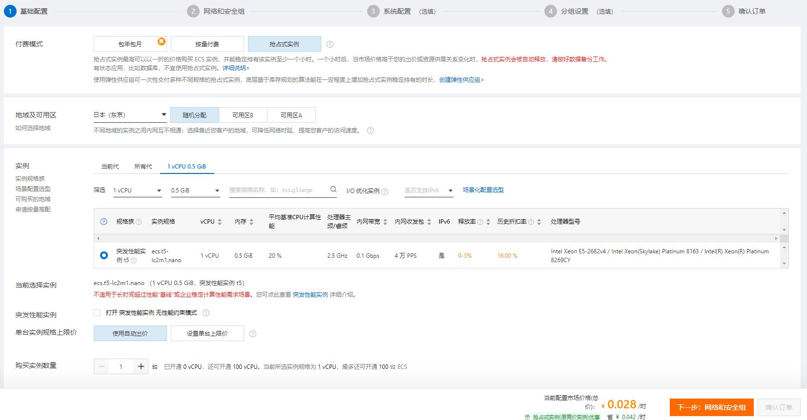
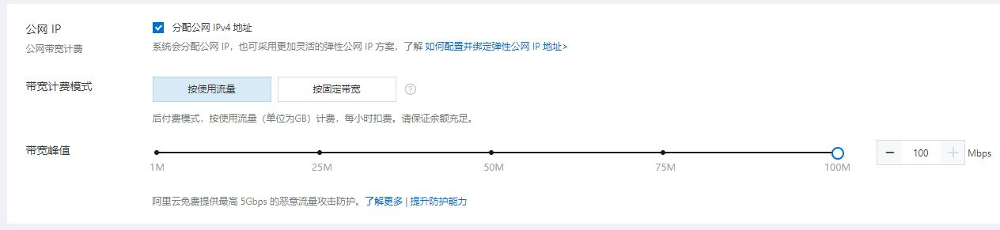

## 前言

请原谅我将标题起的如此杀马特，毕竟正值青年还不想被请去喝茶。

在开始之前需要了解的知识点有 [ECS](https://help.aliyun.com)、[Docker](https://www.docker.com)、[Shadowsocks](https://github.com/shadowsocks/shadowsocks-windows)

关于Shadowsocks的安装教程网上有很多，而本文只记录一个我认为简单便捷的安装过程和开启"飞升通道"的方法。

## 创建ECS

首先你需要一个阿里云账号，注册登录流程略。

接着就可以着手创建一个ECS实例了，但想想我们是用来做什么的，所以请选择大陆以外地区。
而对于钱包羞涩或者应付突发状况的自用情况，这里强烈建议选择“抢占式实例”以及你所能查看到的最小型号服务器以减轻钱包负荷，并且在短暂的使用后释放它。



接着**重点**来了，我们的需求是达到满速，如图所示，请将带宽拉满并选择按使用量付费。至此，请有观影需求的同学谨慎使用。



## 部署 Docker

接着登录ECS部署Docker。因为我选择的操作系统是CentOS，简单列下相关命令，若系统与我相同逐步执行即可。

```
yum install -y yum-utils device-mapper-persistent-data lvm2
yum-config-manager --add-repo http://mirrors.aliyun.com/docker-ce/linux/centos/docker-ce.repo
yum -y install docker-ce
systemctl start docker
systemctl enable docker
```

## 一键部署 Shadowsocks

我们部署Docker的目的只是为了简化Shadowsocks的部署过程。在这里，一条命令足矣，请自行替换密码以及端口，并在安全组中开放该端口。

```
docker run --restart=always -e PASSWORD=<password> -e METHOD=aes-256-gcm -p <server-port>:8388 -p <server-port>:8388/udp -d shadowsocks/shadowsocks-libev
```

## 终

将对应参数填入Shadowsocks客户端的服务器列表并启动就可以开始体验丝般顺滑了。70ms，100M是不是比家用宽带还凶猛。


最终提示，请谨慎使用。


